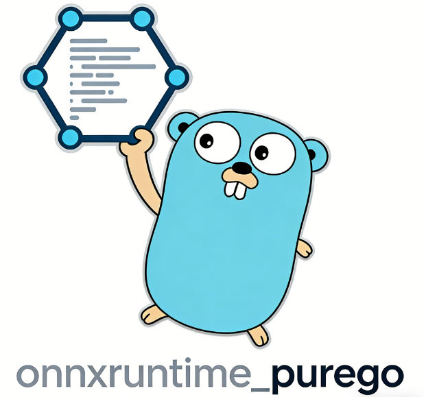
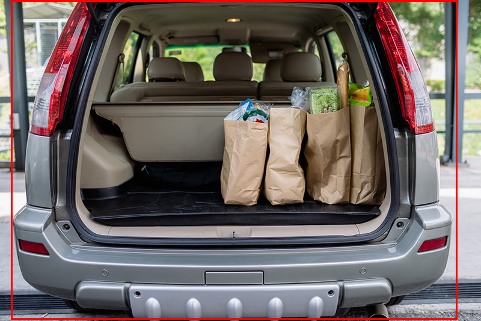

<div align="center" style="text-align: center;">
  
</div>

<p align="center">
   <a href="https://github.com/getcharzp/onnxruntime_purego/fork" target="blank">
      
   </a>
   <a href="https://github.com/getcharzp/onnxruntime_purego/stargazers" target="blank">
      
   </a>
   <a href="https://github.com/getcharzp/onnxruntime_purego/pulls" target="blank">
      
   </a>
</p>

<p align="center">
  English | <a href="./README_zh.md">简体中文</a>
</p>

A CGO-free, pure Go project built on top of `purego`. It binds directly to and calls the native onnxruntime
library interfaces through `purego`, so ONNX models can be loaded and inferred without a CGO build environment.
It is implemented based on the `onnxruntime` 1.26.0 headers.

## Installation

Download the [onnxruntime 1.26](https://github.com/microsoft/onnxruntime/releases/tag/v1.26.0) dynamic library and install the `onnxruntime_purego` package. Version compatibility:

| onnxruntime | onnxruntime_purego |
|-------------|--------------------|
| 1.26        | v1.26.0            |
| 1.25        | v1.25.0            |
| 1.24        | v1.24.0            |
| 1.23        | v1.23.0            |


```shell
# Download the latest version
go get -u github.com/getcharzp/onnxruntime_purego

# Download the specific release for onnxruntime 1.26
go get -u github.com/getcharzp/onnxruntime_purego@v1.26
```

## Quick Start

```go
package main

import (
	ort "github.com/getcharzp/onnxruntime_purego"
	"log"
)

const testModelPath = "./testdata/yolo11n.onnx"

func main() {
	engine, _ := ort.NewEngine(ort.DefaultLibraryPath())
	defer engine.Destroy()
	session, err := engine.NewSession(testModelPath, nil)
	if err != nil {
		log.Fatal(err)
	}
	defer session.Destroy()

	// Prepare the data from the model's own declaration
	input := session.Inputs[0]
	count, ok := input.ElementCount()
	if !ok {
		log.Fatalf("input %q has a dynamic shape %v", input.Name, input.Shape)
	}

	inputValue, err := ort.NewTensor(input.Shape, make([]float32, count))
	if err != nil {
		log.Fatal(err)
	}
	defer inputValue.Destroy()

	outputs, err := session.Run(map[string]*ort.Value{input.Name: inputValue})
	if err != nil {
		log.Fatal(err)
	}

	for name, output := range outputs {
		defer output.Destroy()

		outputData, err := ort.GetTensorData[float32](output)
		if err != nil {
			log.Fatal(err)
		}
		log.Printf("%v: %+v", name, outputData[:min(len(outputData), 20)])
	}
}
```

## Examples

### YOLOv11 Object Detection

| Original Image                                      | Detection Result                                            |
|-----------------------------------------------------|------------------------------------------------------------|
|  |  |

